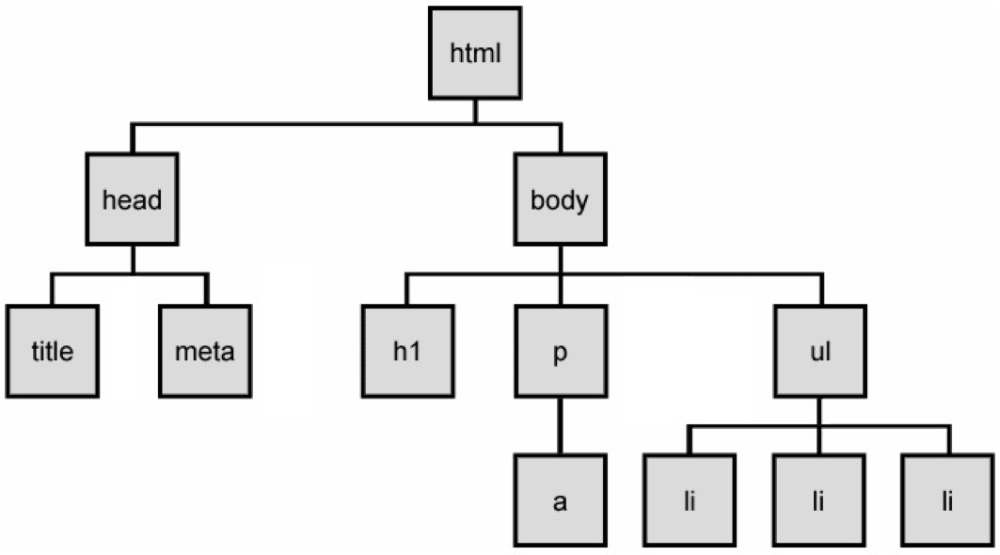
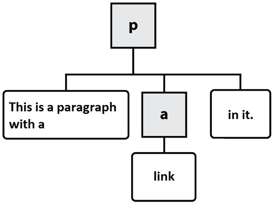
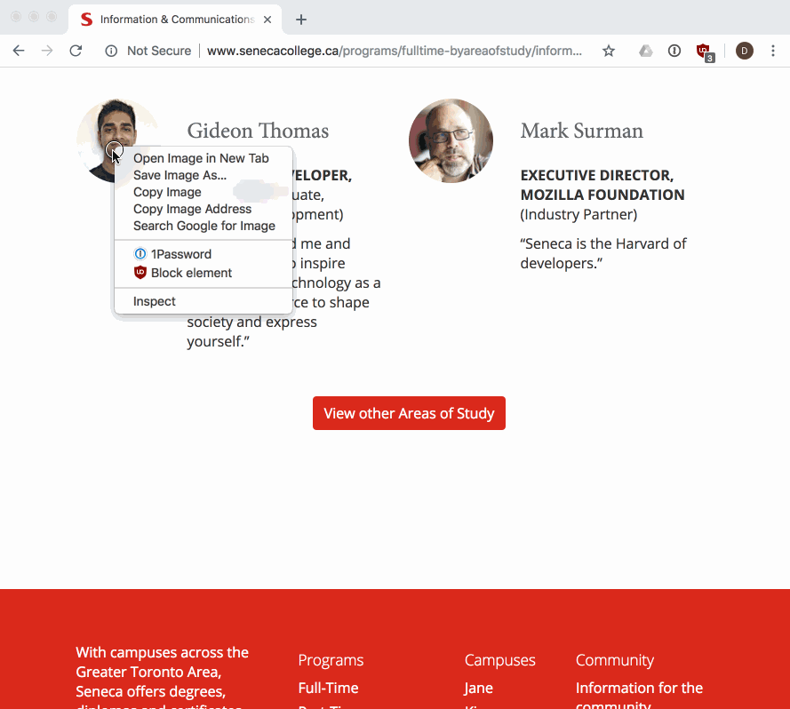
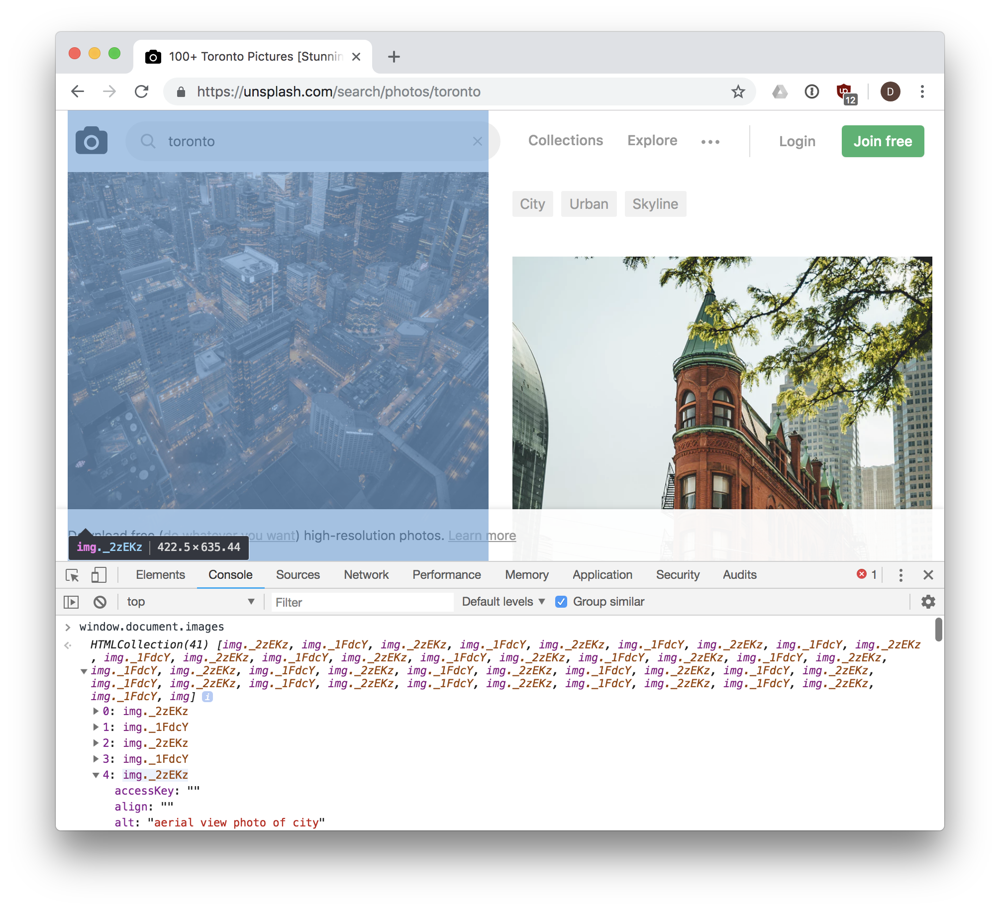

[Go to ToC](../README.md)

# JavaScript and DOM

## ToC
* [From HTML to the DOM](#from-html-to-the-dom)
* [Finding elements in the DOM with JavaScript](#finding-elements-in-the-dom-with-javascript)
* [Creating elements and Modifying the DOM with JavaScript](#creating-elements-and-modifying-the-dom-with-javascript)
* [Inspecting, Modifying a DOM element with JavaScript](#inspecting-modifying-a-dom-element-with-javascript)
* [Events](#events)
* [Common Events](#common-events)
* [Timers](#timers)

###  From HTML to the DOM

Web pages rely on HTML for their initial structure and content.  We write web pages using HTML,
and then use web browsers to parse and render that HTML into a living (i.e., modifiable at runtime)
tree structure.  Consider the following HTML web page:

The DOM Tree is a living version of our HTML.

```html
<!DOCTYPE html>
<html>
    <head>
        <title>This is a Document!</title>
        <meta charset="utf-8">
    </head>
    <body>
        <h1>Welcome!</h1>
        <p>This is a paragraph with a <a href="index.html">link</a> in it.</p>
        <ul>
            <li>first item</li>
            <li>second item</li>
            <li>third item</li>
        </ul>
    </body>
</html>
```

The browser will parse and render this into a tree of nodes, the [DOM Tree](https://en.wikipedia.org/wiki/Document_Object_Model):




* The DOM Tree is made up of **DOM Nodes**, which represent all aspects of our document, from elements to attributes and comments. We’ll refer to nodes and elements interchangeably, because all elements are nodes in the tree. However, there are also other types of nodes, for example: text nodes (the text in a block element) and attribute nodes (key/value pairs). We don’t always show every node in our diagrams. Consider the <p> element from the example above:
  
```html
<p>This is a paragraph with a <a href="index.html">link</a> in it.</p>
```

* Here are the nodes that would be created:

  

* In this diagram, the gray, square boxes represent element nodes, while the white, rounded boxes are text nodes.

* Our DOM Tree gets its name because of its shape: a root element connected to child nodes that extend like the branches of a tree. This tree structure is how the browser views our web page, and is why it is so important for us to open and close our HTML tags in order (i.e., our tags define the structure of the tree that the browser will create at runtime).

* As web developers we can see and interact with the DOM tree for a page using the browser’s built-in developer tools:

* The dev tools allow us to view and work with the parsed DOM elements in a page. We can also use the dev tools to visually select an element in the page, and find its associated DOM element:



Web pages are dynamic: they can change in response to user actions, different data,
JavaScript code, etc.  Where HTML defines the initial structure and content of a page,
the DOM is the *current* or *actual* content of the page as it exists right now in your browser.
And this can mean something quite different from the initial HTML used to load the page.

Consider a web page like GMail (or another email web client).  When you visit your Inbox, the
messages you see are not the same as when your friend visits hers.  The HTML for GMail is the same
no matter who loads the page.  But it quickly changes in response to the needs of the current user.

So how does one modify a web page after it's been rendered in the browser?  The answer is DOM programming.
We've been using this "DOM" acronym without defining it, and its high time we did.

The [Document Object Model (DOM)](https://developer.mozilla.org/en-US/docs/Web/API/Document_Object_Model/Introduction) is a programming interface (i.e., set of Objects, functions, properties) allowing scripts to interact with, and modify documents (HTML, XML).  The DOM is an object-oriented representation of a web page.  Client-side web programming is essentially *using* the DOM via JavaScript to make web pages *do* things or *respond* to actions (e.g., user actions).

You may have noticed in our work with JavaScript that there was nothing particularly “webby” about it as a language: we wrote functions, worked with arrays, created objects. Lots of programming languages let you do this. JavaScript can’t do anything with the web on its own. Instead, we need to access and use the Objects, functions, and properties made available to us by the DOM using JavaScript.

As web programmers we use the DOM via JavaScript to accomplish a number of important tasks:

Finding and getting references to elements in the page
Creating, adding, and removing elements from the DOM tree
Inspecting and modifying elements and their content
Run code in response to events triggered by the user, browser, or other parts of our code
Let’s look at each one in turn.

[🔝](#toc)  
  

### Finding elements in the DOM with JavaScript

* Our entry point to the DOM from JavaScript is via the global variable [`window`](https://developer.mozilla.org/en-US/docs/Web/API/Window).
Every web page runs in an environment created by the browser, and that environment includes
a global variable named [`window`](https://developer.mozilla.org/en-US/docs/Glossary/Global_object#window_object_in_the_Browser),
which is provided by the browser (i.e., we don't create it).

* There are hundreds of Objects, methods, and properties available to our JavaScript code
via `window`.  One example is [`window.document`](https://developer.mozilla.org/en-US/docs/Web/API/Document),
which is how we access the DOM in our code:

```js
// Access the document object for our web page, which is in the current window
let document = window.document;
```

:warning: NOTE: since properties like document are available on the global window object, it is common to simply write document instead of window.document, since the global object is implied if no other scope is given.

Our document's tree of elements are now accessible to us, and we can access a number of 
well-known elements by name, for example:

```js
// Get the value of the document's <title>
let title = document.title;

// Return a reference to the document's <body> element
let body = document.body;

// Return a list of all <a> elements in the document
let hyperlinks = document.links;

// Return a list of all the  elements in the document
let images = document.images;
```
* There are lots more. We can easily experiment with these in the dev tools web console, where we can access our window object

For example, here is the web page
[https://unsplash.com/search/photos/toronto](https://unsplash.com/search/photos/toronto) with the
web console open, and the result of `window.document.images` is shown, 41 `` elements
are returned in a collection:

  


We can also use a number of methods to search for and get a reference to one or more
elements in our document: 

* [`document.getElementById(id)`](https://developer.mozilla.org/en-US/docs/Web/API/Document/getElementById) - returns an element whose `id` attribute/property has the given `id` `String`
    ```html
    <div id="menu">...</div>
    <script>
        var menuDiv = document.getElementById('menu');
    </script>
    ```
* [`document.querySelector(selectors)`](https://developer.mozilla.org/en-US/docs/Web/API/Document/querySelector) - similar to `document.getElementById(id)`, but also allows querying the DOM using [CSS selectors](https://developer.mozilla.org/en-US/docs/Web/CSS/CSS_Selectors) for an element that doesn't have a unique id:
    ```html
    <div id="menu">
        <p class="formatted">...</p>
    </div>
    <script>
        // We can specify we want to query by ID using a leading #
        var menuDiv = document.querySelector('#menu');
        // We can specify we want to query by CLASS name using a leading .
        var para = document.querySelector('.formatted');
    </script>
    ```
* [`document.querySelectorAll(selectors)`](https://developer.mozilla.org/en-US/docs/Web/API/Document/querySelectorAll) - similar to `document.querySelector(selector)`, but returns *all* elements that match the selectors as a [`NodeList`](https://developer.mozilla.org/en-US/docs/Web/API/NodeList):
    ```html
    <div id="menu">
        <p class="formatted">Paragraph 1...</p>
        <p class="formatted">Paragraph 2...</p>
        <p class="formatted">Paragraph 3...</p>
    </div>
    <script>
        // Get all <p> elements in the document as a list
        var pElements = document.querySelectorAll('p');
        // Loop through all returned <p> elements in our list
        pElements.forEach(function(p) { 
            // p is one of the returned <p> elements
        });
    </script>
    ```
These four methods will work in any situation where you need to get a reference to
something in document.  In fact, you could rely solely on `document.querySelector()` and 
`document.querySelectorAll()`, which cover the same functionality as a number of other
DOM methods:

```js
// The following two lines of code do exactly the same thing.
// NOTE the use of # to indicate `demo` is an id in the second example.
var elem = document.getElementById('demo');
var elem = document.querySelector('#demo');
```


[🔝](#toc)  
  
### Creating elements and Modifying the DOM with JavaScript

In addition to searching through the DOM using JavaScript, we can also make changes to it.  The DOM provides a number
of methods that allow use to create new content: 

* [`document.createElement(name)`](https://developer.mozilla.org/en-US/docs/Web/API/Document/createElement) - creates and returns a new element of the type specified by `name`.
    ```js
    var paragraphElement = document.createElement('p');
    var imageElement = document.createElement('img');
    ```
* [`document.createTextNode(text)`](https://developer.mozilla.org/en-US/docs/Web/API/Document/createTextNode) - creates a text node (the text within an element vs. the element itself).
    ```js
    var textNode = document.createTextNode('This is some text to show in an element');
    ```

These methods create the new nodes, but do not place them into the page.  To do that, we first need to find
the correct position within the exsting DOM tree, and then add our new node.  We have to be clear *where* we want
the new element to get placed in the DOM.

For example, if we want to place a node at the end of the `<body>`, we could use `.appendChild()`:

```js
var paragraphElement = document.createElement('p');
document.body.appendChild(paragraphElement);
```

If we instead wanted to place it within an existing `<div id="content">`, we'd do this:

```js
var paragraphElement = document.createElement('p');
var contentDiv = document.querySelector('#content');
contentDiv.appendChild(paragraphElement);
```

Both examples work the same way: given a parent node (`document` or `<div id="content">`), add
(append to the end of the list of children) our new element.

We can also use `.insertBefore(new, old)` to accomplish something similar: add our new node before
the `old` (existing) node in the DOM:

```js
var paragraphElement = document.createElement('p');
var contentDiv = document.querySelector('#content');
var firstDivParagraph = contentDiv.querySelector('p');
contentDiv.insertBefore(paragraphElement, firstDivParagraph);
```

Removing a node is similar, and uses `removeChild()`:

```js
// Remove a loading spinner
var loadingSpinner = document.querySelector('#loading-spinner');
// Get a reference to the loading spinner's parent element
var parent = loadingSpinner.parentNode;
parent.removeChild(loadingSpinner);
```

### Examples

1. Add a new heading to a document
    ```js
    // Create a new <h2> element
    var newHeading = document.createElement('h2');

    // Add some text to the <h2> element we just created.
    // Similar to doing <h2>This is a heading</h2>.
    var textNode = document.createTextNode('This is a heading');
    // Add the textNode to the heading's child list
    newHeading.appendChild(textNode);

    // Insert our heading into the document, at the end of <body>
    document.body.appendChild(newHeading);
    ```
1. Create a new paragraph and insert into the document
    ```html
    <div id="demo"></div>
    <script>
        // Create a <p> element
        var pElem = document.createElement('p');

        // Use .innerHTML to create text nodes inside our <p>...</p>
        pElem.innerHTML = 'This is a paragraph.';

        // Get a reference to our <div> with id = demo
        var demoDiv = document.querySelector('#demo');

        // Append our <p> element to the <div>
        demoDiv.appendChild(pElem);
    </script>
    ```


  
[🔝](#toc)  

### Inspecting, Modifying a DOM element with JavaScrip

Once we have a reference to an element in JavaScript, we use a number of properties and methods to
work with it.

### [Element Properties](https://developer.mozilla.org/en-US/docs/Web/API/Element#Properties)

* `element.id` - the `id` of the element.  For example: `<p id="intro"></p>` has an `id` of `"intro"`. 
* `element.innerHTML` - gets or sets the markup contained within the element, which could be text, but could also include other HTML tags.
* `element.parentNode` - gets a reference to the parent `node` of this element in the DOM.
* `element.nextSibling` - gets a refernce to the sibling element of this element, if any.
* `element.className` - gets or sets the value of the `class` attribute for the elmenet.

### [Element Methods](https://developer.mozilla.org/en-US/docs/Web/API/Element#Methods)

* `element.querySelector()` - same as `document.querySelector()`, but begins searching from `element` vs. `document`
* `element.querySelectorAll()` - same as `document.querySelectorAll()`, but begins searching from `element` vs. `document`
* `element.scrollIntoView()` - scrolls the page until the element is in view.

* `element.hasAttribute(name)` - checks if the attribute `name` exists on this `element`
* `element.getAttribute(name)` - gets the value of the attribute `name` on this `element`
* `element.setAttribute(name, value)` - sets the `value` of the attribute `name` on this `element`
* `element.removeAttribute(name)` - removes the attribute `name` from this `element`

### Examples

1. Reveal an error message in the page, by removing an element's `hidden` attribute
    ```html
    <!-- The `hidden` attribute means this <div> won't be displayed until it's removed -->
    <div id="error-message" hidden>
        <p>There was an error saving the document.  Please try again!</p>
    </div>
    <script>
        // Try to save the file, and 
        var error = saveFile(); 
        if(error) {
            var elem = document.querySelector('#error-message');
            elem.removeAttribute('hidden');
        }
    </script>
    ```
1. Insert a user's profile picture into the page
    ```js
    // Insert the user's picture (e.g., in response to hovering over a username)
    var profilePic = document.createElement('img');

    // Set attributes via getters/setters on the element vs. attributes
    profilePic.id = 'user-' + username;
    profilePic.height = 50;
    profilePic.src = './images/' + username + '-user-profile.jpg';

    // Insert the profile pic  into the document
    document.body.appendChild(profilePic);

    // Make sure the new image is visible, or scroll until it is
    profilePic.scrollIntoView();
    ```
1. Add new paragraph elements to a div
    ```js
    // Use .innerHTML as a getter and setter to update some text
    var elem = document.querySelector('#text');

    elem.innerHTML = '<p>This is a paragraph</p>';
    elem.innerHTML = elem.innerHTML + '<p>This is another paragraph</p>';
    ```


  
[🔝](#toc)  

### Events

The DOM relies heavily on a concept known as [event-driven programming](https://en.wikipedia.org/wiki/Event-driven_programming).
In event-driven programs,
a main loop (aka the *event loop*), processes events as they occur.

Examples of events include things like user actions (clicking a button, moving the mouse,
pressing a key, changing tabs in the browser), or browser/code initiated actions (timers,
messages from background processes, reports from sensors).

Instead of writing a program in a strict order, we write functions that should be called
in response to various events occurring.  Such functions are often referred to as
*event handlers*, because they handle the case of some event happening.  If there is no
event handler for a given event, when it occurs the browser will simply ignore it.  However,
if one or more event handlers are registered to listen for this event, the browser will
call each event handler's function in turn.

> You can think of events like light switches, and event handlers like light fixtures: flipping a light switch on or off triggers an action in the light fixture, or possibly in multiple light fixtures at once.  The lights handle the event of the light switch being flipped.

DOM programming is typically done by writing many functions that execute in response
to events in the browser.  We register our event handlers to indicate that we want a particular
action to occur.  DOM events have a `name` we use to refer to them in code.

We can register a DOM event handler for a given event in one of two ways: 

1. `element.onevent = function(e) {...};`
1. `element.addEventListener('event', function(e) {...})` and `element.removEventListener('event', function(e) {...})`

In both cases above, we first need an HTML element.  Events are emitted to a *target* element.
Elements in the DOM can trigger one or more events, and we must know the name of the event we want
to handle.

In the first method above, `element.onevent = function(e) {...};`, a single event handler is registered
for the `event` event connected with the target element `element`.  For example, `document.body.onclick = function(e) {...};`,
indicates we want to register an event handler for the `click` event on the `document.body` element (i.e., `<body>...</body>`).

In the second method above, use `addEventListener()` to add as many individual, separate event handlers as we need.
Whereas `element.onclick = function(e) {...};` binds a single event handler (function) to the `click` event for `element`,
using `element.addEventListener('click', function(e) {...});` *adds* a new event handler (function) to any that might already
exist.

Consider the following code:

```js
var body = document.body;

function handleClick(e) {
    // Process the click event
}

function handleClick2(e) {
    // Another click handler
}

body.onclick = handleClick;
body.onclick = handleClick2;
// There is only 1 click event handler on body: handleClick2 has replaced handleClick.

body.addEventListener('click', handleClick);
body.addEventListener('click', handleClick2);
// There are now multiple, unique click handlers bound to the body's click event.
```

Because `addEventListener()` is more versatile than the older `onevent` properties, you are
encouraged to use it in most cases.

Here's an example of the first method, where we only need a single event handler.
In the following case, a web page has a Save button, and we want to save the user's
work when she clicks it.

```html
<button id='btn-save'>Save</button>
<script>
    // Get a reference to our Save <button>
    var saveBtn = document.querySelector('#btn-save');

    function save() {
        // Save the user's work
    }

    // Register a single event handler on the save button's click event
    saveBtn.onclick = function(e) {
        // Save the user's work, calling a save() function we wrote elsewhere
        save();
    };
</script>
```

Now consider the same code, but with multiple event handlers.  In this case
we not only want to save the user's work, but also log the information in our
web analytics so we can keep track of how popular this feature is (how many times
it gets clicked):

```html
<span id="needs-saving">Document has changes, Remember to Save!</span>
...
<button id='btn-save'>Save</button>
<script>
    // Get a reference to our Save <button>
    var saveBtn = document.querySelector('#btn-save');

    // Register first event handler on the save button's click event
    saveBtn.addEventListener('click', function(e) {
        // Save the user's work, calling a save() function we wrote elsewhere
        save();

        // Remove the "needs to be saved" info showing in our UI, since we've saved
        document.querySelector('#btn-save').setAttribute('hidden', true);
    });

    // Register second event handler on the save button's click event
    saveBtn.addEventListener('click', function(e) {
        // Log some info to the console for debugging.
        console.log('[DEBUG] Save clicked');

        // Use an analytics Object (defined elsewhere) to update our count for this event
        analytics.increment('save');
    });
</script>
```

In this second example, it's possible for the browser to call more than one function
(event handler) in response to a single event (`click`).  What's nice about this is that
different parts of our code don't have to be combined into a single function.  Instead,
we can keep things separate (saving logic vs. analytics logic).

A complete example of a page that listens for changes to the network online/offline status,
and updates the page accordingly, is available at [online.html](online.html).


  
[🔝](#toc)  

### Common Events

There are [many types of events we can listen for in the DOM](https://developer.mozilla.org/en-US/docs/Web/Events),
some of which are very specialized to certain elements or Objects.  However, there some common ones we'll use quite often:

* [`load`](https://developer.mozilla.org/en-US/docs/Web/Events/load) - fired when a resource has finished loading (e.g., a `window`, `img`)
* [`beforeunload`](https://developer.mozilla.org/en-US/docs/Web/Events/beforeunload) - fired just before the window is about to be unloaded (closed)
* [`focus`](https://developer.mozilla.org/en-US/docs/Web/Events/focus) - when the element receives focus (cursor input)
* [`blur`](https://developer.mozilla.org/en-US/docs/Web/Events/blur) - when the element loses focus
* [`click`](https://developer.mozilla.org/en-US/docs/Web/Events/click) - when the user single clicks on an element
* [`dblclick`](https://developer.mozilla.org/en-US/docs/Web/Events/dblclick) - when the user double clicks on an element
* [`contextmenu`](https://developer.mozilla.org/en-US/docs/Web/Events/contextmenu) - when the right mouse button is clicked
* [`keypress`](https://developer.mozilla.org/en-US/docs/Web/Events/keypress) - when a key is pressed on the keyboard
* [`change`](https://developer.mozilla.org/en-US/docs/Web/Events/change) - when the content of an element changes (e.g., an input element in a form)
* [`mouseout`](https://developer.mozilla.org/en-US/docs/Web/Events/mouseout) - when the user moves the mouse outside the element
* [`mouseover`](https://developer.mozilla.org/en-US/docs/Web/Events/mouseover) - when the user moves the mouse over top of the element
* [`resize`](https://developer.mozilla.org/en-US/docs/Web/Events/resize) - when the element is resized

All of the events described above can be used in either of the two ways we discussed above.
For example, if we wanted to use the `mouseout` event on an element:

```html
<div id="map">...</div>
<script>
    var map = document.querySelector('map');

    // Method 1: register a single event handler via the on* property
    map.onmouseout = function(e) {
        // do something here in response to the mouseout event on this div.
    }

    // Method 2: register one of perhaps many event handlers via addEventListener
    map.addEventListener('mouseout', function(e) {
        // do something here in response to the mouseout event on this div.
    });
</script>
```

#### The [`Event` Object](https://developer.mozilla.org/en-US/docs/Web/API/Event) 

In the example code above, you may have noticed that our event handler functions often looked like this:

```js
element.onclick = function(e) {
    // e is an instance of the Event object
}
```

The single `e` argument is an instance of the [`Event` Object](https://developer.mozilla.org/en-US/docs/Web/API/Event).
The `e` or `event` is provided to our event handler function in order to pass information about the event, and to give
us a chance to alter what happens next.

For example, we can get a reference to the element to which the event was dispatched using
[`e.target`](https://developer.mozilla.org/en-US/docs/Web/API/Event/target).  We can also instruct
the browser to prevent the "default" action from happening as a result of this event using
[`e.preventDefault()`](https://developer.mozilla.org/en-US/docs/Web/API/Event/preventDefault), or
stop the event from continuing to *bubble* up the DOM (i.e., rise up the DOM tree nodes, triggering
other event handlers along the way) using [`e.stopPropagation()](https://developer.mozilla.org/en-US/docs/Web/API/Event/stopPropagation).

Here's an example showing how to use these:

```html
<button id="btn">Click Me</button>
<script>
    document.querySelector('#btn').addEventListener('click', function(e) {
        // Prevent this event from doing anything more, we'll handle it all here.
        e.preventDefault();
        e.stopPropagation();

        // Get a reference to the <button> element
        var btn = e.target;
        
        // Change the text of the button
        btn.innerHTML = "You clicked Me!"
    });
</script>
```

Some events also provide specialized (i.e., derived from `Event`) `event` Objects
with extra data on them related to the context of the event.  For example, a [`MouseEvent`](https://developer.mozilla.org/en-US/docs/Web/API/MouseEvent)
gives extra detail whenever a click, mouse move, etc. event occurs:

```html
<div id="position"></div>
<script>
    document.body.addEventListener('click', function(e) {
        // Get extra info about this mouse event so we know where the pointer was
        var x = e.screenX;
        var y = e.screenY;

        // Display co-ordinates where the mouse was clicked: "Position (300, 342)"
        document.querySelector('#position').innerHTML = `Position (${x}, ${y})`
    });
</script>
```


[🔝](#toc)    
  
  
### Timers


It's also possible for us to write an event handler that happens in response to a timing event (delay) vs.
a user or browser event.  Using these timing event handlers, we scheduling a task (function) to run after
a certain period of time has elapsed:

* `setTimeout(function, delayMS)` - schedule a task (`function`) to be run in the future (`delayMS` milliseconds from now).  Can be cancelled with `clearTimeout(timerID)`
* `setInterval(function, delayMS)` - schedule a task (`function`) to be run in the future every `delayMS` milliseconds from now.  Function will be called repeatedly.  Can be cancelled with `clearInterval(timerID)`

Here's an example of using an `interval` to update a web page with the current date and time every 1 second.

```html
<p hidden>The current date and time is <time id="current-date"></time></p>
<button id="btn-start">Start Timer</button>
<button id="btn-end">End Timer</button>
<script>
    var startButton = document.querySelector('#btn-start');
    var endButton = document.querySelector('#btn-end');
    var timerId;

    // When the user clicks Start, start our timer
    startButton.onclick = function(e) {
        // If the user clicks it more than once, ignore it once it's running
        if(timerId) {
            return;
        }

        var currentDate = document.querySelector('#current-date');
        currentDate.removeAttribute('hidden');

        // Start our timer to update every 1000ms (1s), showing the current date/time.
        timerId = setInterval(function() {
            var now = new Date();
            currentDate.innerHTML = now.toLocaleString();
        }, 1000);
    };

    endButton.onclick = function(e) {
        // If the user clicks End when the timer isn't running, ignore it.
        if(!timerId) {
            return;
        }

        // Stop the timer
        clearInterval(timerId);
        timerId = null;
    };
</script>
```


  
[🔝](#toc)  

  
  
  
