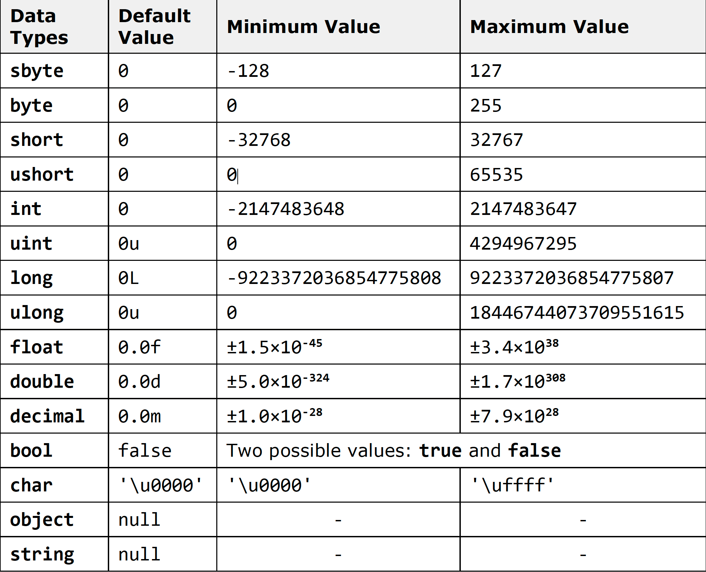

[Go to ToC](../README.md)

# Data Types

## ToC

- [Intro](#intro)
- [Data Types](#data-types)
    - [Types](#types)
    - [Chart](#chart)

## Intro

In this lesson, we'll cover C# **primitive data types** and how to work with them. Examples of primitive data types are : integer, real types with floating-point, Boolean, character, string and object type. They are divided into two major sets: **value types** and **reference types**.

[🔝](#toc)

## Data Types

**Data types** are sets (ranges) of values that have similar characteristics. For instance **byte** type specifies the set of integers in the range of [0 ... 255]

[🔝](#toc) 

### Characteristics

Data Types are characterized by:

- **Name** - for example **int**
- **Size** - for example **4 bytes**
- **Default value** - for example **0**

[🔝](#toc)  

### Types

Basic data types in C# are distributed into the following **types**:
- Integer types – **sbyte, byte, short, ushort, int, uint, long, ulong**;
- Real floating-point types – **float, double**;
- Real type with decimal precision – **decimal**;
- Boolean type – **bool**;
- Character type – **char**;
- String – **string**;
- Object type – **object**.
These data types are called **primitive (built-in types)**, because they are embedded in C# language at the lowest level. The table below represents the above mentioned data types, their range and their default values:

### Chart

