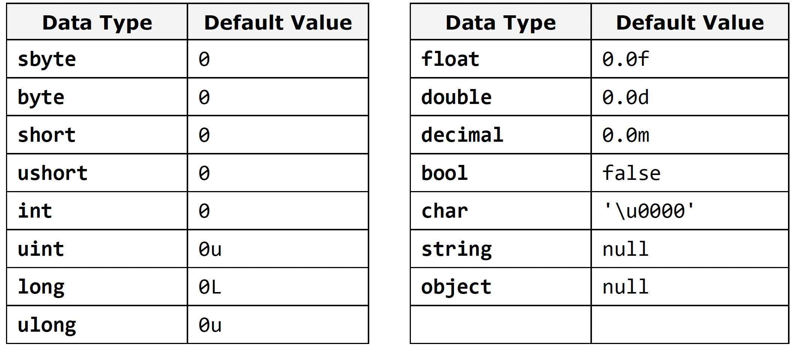

[Go to ToC](../README.md)

# Variables

## ToC
* [Variables](#variables)
    * [Characteristics of Variables](#characteristics)
    * [Naming Variables](#naming-variables)
    * [Declaring Variables](#declaring-variables)
    * [Initializing Variables](#initializing-variables)
* [Value and Reference Types](#value-and-reference-types)
* [Literals](#Literals)


## Variables

* After reviewing the main data types in C# let's see how we can use them. In order to work with data we should use **variables.**. We have already seen their usage in the examples, but now let's look at them in more detail.

* A **variable** is a **container of information**, which can change its value. It provides means for:

- Storing information;
- Retrieving the stored information (get);
- Modifying the stored information(set);


[🔝](#toc)  
  

### Characteristics

Variables are characterized by:
- **name** (identifier), for example **age**
- **type** (of information preserved in them), for example **int**
- **value** (stored information), for exampe **25**


* Variable is a named area of memory, which stores a value from a particular data type.
    * Variables can be stored directly in the operational mmemory of the program (stack) or in the dynamic memory (heap) in which larger objects are stored ( such as character strings and arrays)

* **Primitive data types**:
    * numbers, char, bool
    * store their value in the program stack
* **Reference data types**:
    * strings, objects, arrays
    * store an address where the value is stored (heap / dynamic memory)


[🔝](#toc)  
  
### Naming Variables

* The name of the variable can be any of our choice but must follow certain rules defined in the C# language specification:
    * Variable name can contain letters **a-z, A-Z**, the digits **0-9**, as well as the character **`_`**
    * Variable names **cannot** start with **digit**
    * Variable names **cannot** be a C# **keyword**. (`base, char, default, int, object, this, null...)
⚠️ If we want to name a variable like keyword, we can add a prefix to the name `@`. For example, `@char` and `@null` are valid variable names while **char** and **null** are invalid

* Examples:
    * `name`
    * `first_Name`
    * `_name1`
  
[🔝](#toc)  

### Recommendations

* If the compiler allows a certain name as valid, doesn't mean it's appropriate.

- Names should be descriptive and explain what the variable is used for.
- Only Latin characters should be used
- C# recommends to **start with a small letter** and continue with words that start with capital letter. 
    * `firstName` => is better than `first_name` or `firstname`. 
- Variable names should be **neither too long or too short** - they just need to clarify the purpose of the variable within its context

### Examples

Good:

- `firstName`
- `age`
- `startIndex`
- `lastNegativeNumberIndex`

Bad:

- `_first`
- `last_name` (contains _)
- `AGE` (all caps)
- `Start_Index` (contains _ and starts with Capital)
- `lastNegaiveNumber_Index` (contains _)
- `a38` (not descriptive)
- `fullName23`, `fullName24` (if it doesn't add clarity, don't include numbers)

### Declaring Variables

When you declare a variable, you perform the following steps

1. specify its **type** -> `int`
2. specify its **name** -> `age`
3. optionally specify **initial value** -> `25`

```c#
// <data type> <identifier> [= <initialization>];
string name;
int age;

name = "john doe";
age = 25;

```
  
[🔝](#toc)  

### Initializing Variables

* Initializatin means specifying an initial value. When setting value to variables at the time of their eclaration we actually initialize them.
* Each data type in C# has a **default value** which is used when no initial value is provided when declared.



```c#
byte centuries = 20;
ushort years = 2000;
decimal decimalPI = 3.141592653589793238m;
bool isEmpty = true;
char ch = 'a';
string firstName = "John";

// use already initialized variable and reassign it
char secondChar = ch;
```
  
[🔝](#toc)  

## Value and Reference Types

* Data types in C# are two types: **value** and **reference**

### Value Types
* Value Types are stored in execution stack and directly contain their value. They are numeric, character and boolean types
    * `sbyte, byte, short, ushort, int, long, ulong, float, double, decimal, char, bool`
    * The memory allocated for them is released when the program exits their range. i.e: when block of code `{}` exits.
    * Variables declared in `Main()` is stored in the stack until the program completes execution of this method.

### Reference Types

* Reference Types keep a **reference (address) ** in the program execution stack, and that reference points to the **dynamic memory (heap), where their value is stored.
    * This reference is a **pointer** indicating to the actual location of the value in the heap. 
    * The reference has a type and can only point to objects of the same type
    * All reference types can hold a `null` value.

### Example

* Consider teh execution of the following programming code:

```C#

int i = 42; 
char ch = 'A';
bool result = true; 
object obj = 42; 
string str = "Hello"; 
byte[] bytes = { 1, 2, 3 };

```


[🔝](#toc)    
  
  
### 


  
  
[🔝](#toc)  

###


  
[🔝](#toc)  

### 


[🔝](#toc)    
  
  
### 


  
[🔝](#toc)  

  
  
  