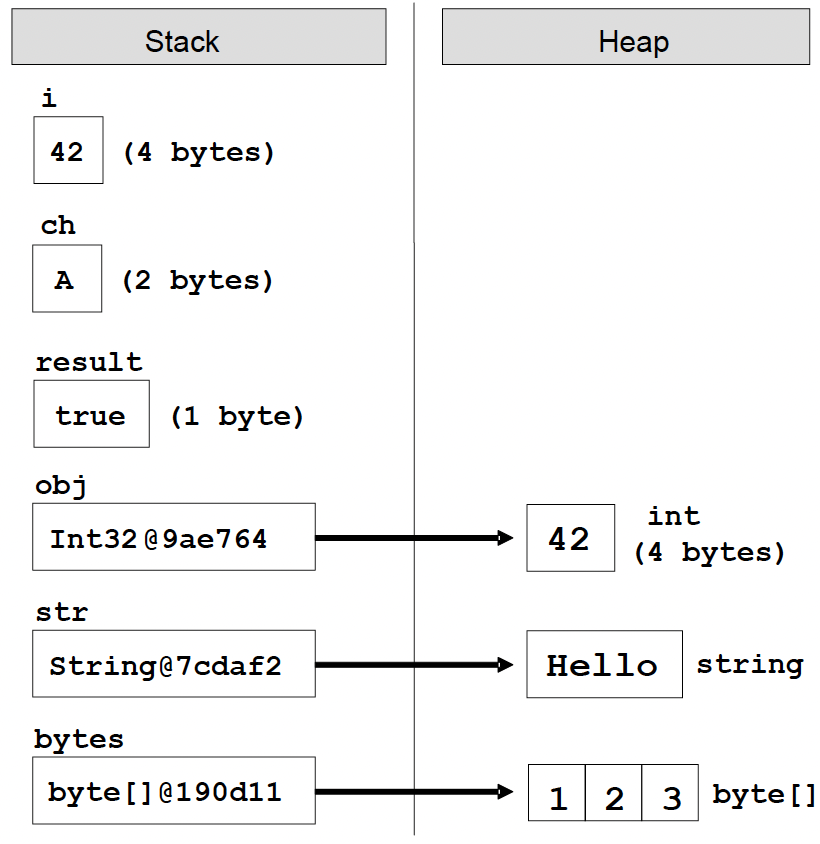
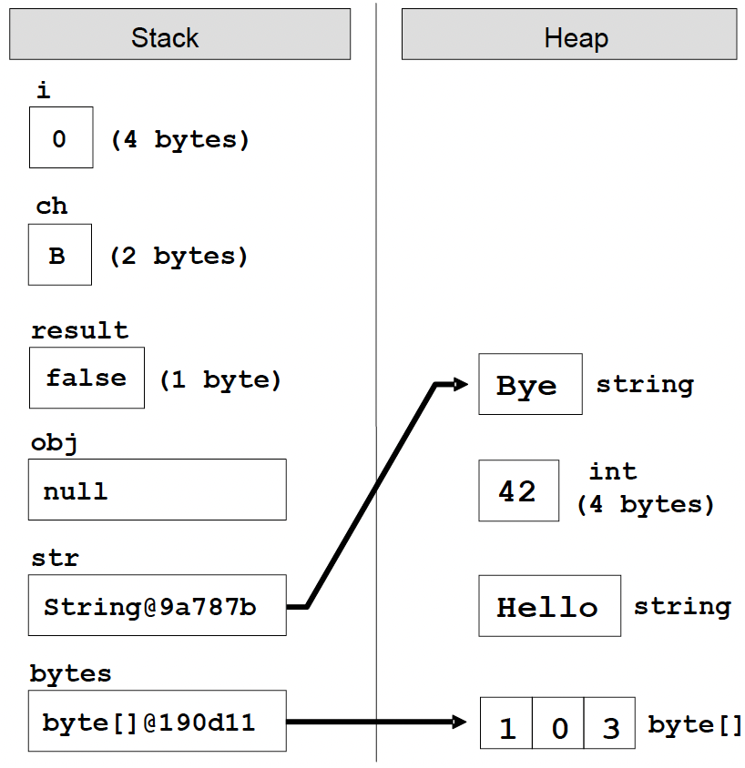

[Go to ToC](../README.md)

# Variables

## ToC
* [Variables](#variables)
    * [Characteristics of Variables](#characteristics)
    * [Naming Variables](#naming-variables)
    * [Declaring Variables](#declaring-variables)
    * [Initializing Variables](#initializing-variables)
* [Value and Reference Types](#value-and-reference-types)
    * [Value Types](#value-types)
    * [Reference Types](#reference-types)
    * [Example](#example)
* [Literals](#Literals)
    * [Boolean Literals](#boolean-literals)
    * [Integer Literals](#integer-literals)
    * [Real Literals](#real-literals)
    * [Character Literals](#character-literals)
    * [String Literals](#string-literals)


## Variables

* After reviewing the main data types in C# let's see how we can use them. In order to work with data we should use **variables.**. We have already seen their usage in the examples, but now let's look at them in more detail.

* A **variable** is a **container of information**, which can change its value. It provides means for:

- Storing information;
- Retrieving the stored information (get);
- Modifying the stored information(set);


[🔝](#toc)  
  

### Characteristics

Variables are characterized by:
- **name** (identifier), for example **age**
- **type** (of information preserved in them), for example **int**
- **value** (stored information), for exampe **25**


* Variable is a named area of memory, which stores a value from a particular data type.
    * Variables can be stored directly in the operational mmemory of the program (stack) or in the dynamic memory (heap) in which larger objects are stored ( such as character strings and arrays)

* **Primitive data types**:
    * numbers, char, bool
    * store their value in the program stack
* **Reference data types**:
    * strings, objects, arrays
    * store an address where the value is stored (heap / dynamic memory)


[🔝](#toc)  
  
### Naming Variables

* The name of the variable can be any of our choice but must follow certain rules defined in the C# language specification:
    * Variable name can contain letters **a-z, A-Z**, the digits **0-9**, as well as the character **`_`**
    * Variable names **cannot** start with **digit**
    * Variable names **cannot** be a C# **keyword**. (`base, char, default, int, object, this, null...`) 
   
⚠️ If we want to name a variable like keyword, we can add a prefix to the name `@`. For example, `@char` and `@null` are valid variable names while **char** and **null** are invalid

* Examples:
    * `name`
    * `first_Name`
    * `_name1`
  
[🔝](#toc)  

### Recommendations

* If the compiler allows a certain name as valid, doesn't mean it's appropriate.

- Names should be descriptive and explain what the variable is used for.
- Only Latin characters should be used
- C# recommends to **start with a small letter** and continue with words that start with capital letter. 
    * `firstName` => is better than `first_name` or `firstname`. 
- Variable names should be **neither too long or too short** - they just need to clarify the purpose of the variable within its context

### Examples

Good:

- `firstName`
- `age`
- `startIndex`
- `lastNegativeNumberIndex`

Bad:

- `_first`
- `last_name` (contains _)
- `AGE` (all caps)
- `Start_Index` (contains _ and starts with Capital)
- `lastNegaiveNumber_Index` (contains _)
- `a38` (not descriptive)
- `fullName23`, `fullName24` (if it doesn't add clarity, don't include numbers)

### Declaring Variables

When you declare a variable, you perform the following steps

1. specify its **type** -> `int`
2. specify its **name** -> `age`
3. optionally specify **initial value** -> `25`

```c#
// <data type> <identifier> [= <initialization>];
string name;
int age;

name = "john doe";
age = 25;

```
  
[🔝](#toc)  

### Initializing Variables

* Initializatin means specifying an initial value. When setting value to variables at the time of their eclaration we actually initialize them.
* Each data type in C# has a **default value** which is used when no initial value is provided when declared.


```c#
byte centuries = 20;
ushort years = 2000;
decimal decimalPI = 3.141592653589793238m;
bool isEmpty = true;
char ch = 'a';
string firstName = "John";

// use already initialized variable and reassign it
char secondChar = ch;
```
  
[🔝](#toc)  

## Value and Reference Types

* Data types in C# are two types: **value** and **reference**

### Value Types
* Value Types are stored in execution stack and directly contain their value. They are numeric, character and boolean types
    * `sbyte, byte, short, ushort, int, long, ulong, float, double, decimal, char, bool`
    * The memory allocated for them is released when the program exits their range. i.e: when block of code `{}` exits.
    * Variables declared in `Main()` is stored in the stack until the program completes execution of this method.

### Reference Types

* Reference Types keep a **reference (address) ** in the program execution stack, and that reference points to the **dynamic memory (heap), where their value is stored.
    * This reference is a **pointer** indicating to the actual location of the value in the heap. 
    * The reference has a type and can only point to objects of the same type
    * All reference types can hold a `null` value.

### Example

* Consider teh execution of the following programming code:

```C#

int i = 42; 
char ch = 'A';
bool result = true; 
object obj = 42; 
string str = "Hello"; 
byte[] bytes = { 1, 2, 3 };

```



* Following is what happens when values are changed:

```C#
i = 0; 
ch = 'B';
result = false; 
obj = null; 
str = "Bye"; 
bytes[1] = 0;
```




[🔝](#toc)    
  
  
## Literals

* Primitive types, which we already met, are special data types built into the C# language. Their values specified in the source code of the program are called **literals**.

```c#
bool result = true; 
char capitalC = 'C'; 
byte b = 100; 
short s = 20000; 
int i = 300000;
```

* In C# language, there are several types of literals:
    - Boolean
    - Integer
    - Real
    - Character
    - String
    - Object literal `null`
  
[🔝](#toc)  

### Boolean Literals

* Boolean Literals are:
    * `true`
    * `false`
* When we assign a value to a variable of type bool we can use only one of these two values or a Boolean expression (which is calculated to `true` or `false`).

```c#
bool result = true;
```
  
[🔝](#toc)  

### Integer Literals
* Integer literals are **sequences of digits**, a sign (+, -), **suffixes** and **prefixes**
* Using **prefixes** we can present integers in the program source in decimal or hexadecimal format.
    * '0x' and '0X' as prefix indicates hexadecimal values, for example 0xA8F1;
    ```c#
    int numberInDec = 16; 
    int numberInHex = 0x10;
    ```
* Using **suffixes**:
    * `'l'` and `'L'` as suffix indicates `long` type data, for example **357L**.
    * `'u'` and `'U'` as suffix indicates `uint` or `ulong` data type, for example **112u**.
    ```c#
    long longNumber = 357L;
    uint unsignedInt = 112u;
    // Error: 234L is not an int;
    int longInt = 234L
    ```
  
* By default (if no suffix is used) the integer literals are of type `int`.

[🔝](#toc) 

### Real Literals

* Real literals are a **sequence of digits**, a sign (+, -), suffixes and the decimal point character.
* We use them for values of type **float**, **double** and **decimal**.
* Real literals can be represented in exponential format.
    - `'f'` and `'F'` as suffixes mean data of type **float**;
    - `'d'` and `'D'` as suffixes mean data of type **double**;
    - `'m'` and `'m' `as suffixes mean data of type **decimal**;
    - `'e'` is an **exponent**, for example, "`e-5`" means the integer part multiplied by 10^-5.

```c#
// The following is the correct way of assigning a value: 
float realNumber = 12.5f;

// This is the same value in exponential format: 
realNumber = 1.25e+1f;

// Error, because 12.5 is double 
float realNumber = 12.5;
```
* By default (if there is no suffix), the real numbers are of type `double`.


[🔝](#toc) 

### Character Literals

Character literals are **single characters enclosed in apostrophes (single quotes)**. We use them to set the values of type `char`. The value of a character literal can be:
- a character, for example `'A'`;
- a character code, for example `'\u0065'`;
- an escaping sequence;
    * They are a sequence of special characters, which describe a character that cannot be written directly in the source code.
        - `\'` – single quote
        - `\"` – double quotes
        - `\\` – backslash
        - `\n` – new line
        - `\t` – offset (tab)
        - `\uXXXX` – char specified by its Unicode number, for example `\u03A7`.

```C#
// An ordinary character 
char character = 'a'; 
Console.WriteLine(character);
// Unicode character code in a hexadecimal format 
character = '\u003A'; Console.WriteLine(character);
// Assigning the single quotiation character (escaped as \') 
character = '\''; Console.WriteLine(character);
// Assigning the backslash character (escaped as \\) 
character = '\\'; Console.WriteLine(character);
// Console output: 
// a 
// : 
// ' 
// \
```

[🔝](#toc) 

### String Literals

* String literals are used for data of type `string`. They are a sequence of characters enclosed in **double quotation** marks.
* All the escaping rules for the `char` type discussed above are also valid for `string` literals.

* Strings can be preceded by the `@` character that specifies a quoted string (**verbatim string**). In quoted strings the rules for escaping are not valid, i.e. the character `\` means `\` and is not an escaping character.
  
```C#
string quotation = "\"Hello, Jude\", he said.";
Console.WriteLine(quotation);

string path = "C:\\Windows\\Notepad.exe";
Console.WriteLine(path);

string verbatim = @"The \ is not escaped as \\.I am at a new line.";
Console.WriteLine(verbatim);

// Console output: 
// "Hello, Jude", he said. 
// C:\Windows\Notepad.exe 
// The \ is not escaped as \\. 
// I am at a new line.

```
[🔝](#toc)  

  
  
  
