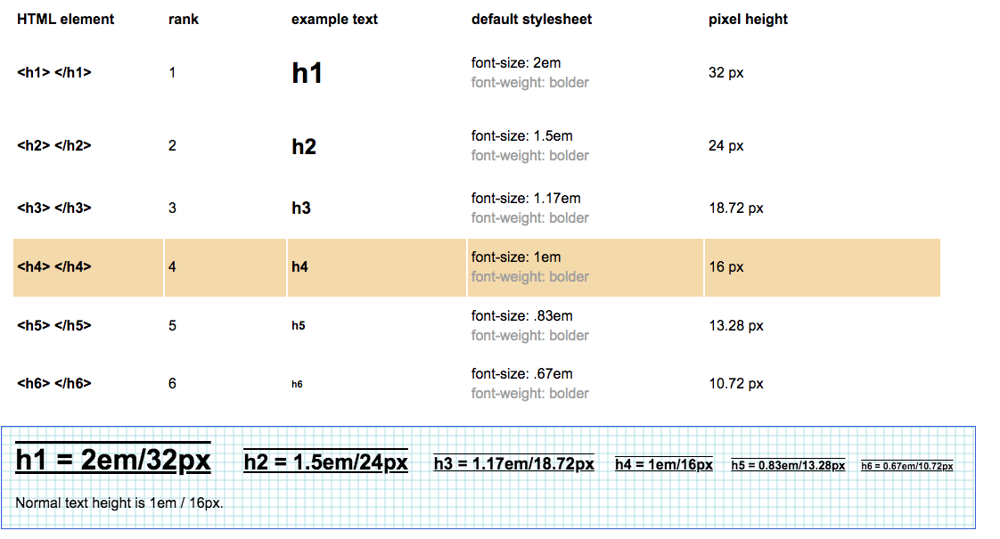

[Go to ToC](../README.md)

# Visual Design with CSS - P2

## ToC
* [Italicize Text](#font-style-italic---italicize-text) 
* [Strikethrough](#text-decoration-line-through--s---strikethrough-text)
* [Horizontal Line](#hr---horizontal-line)
* [Background Color](#background-color-rgba)
* [Font Size](#font-size--h1h6-tags)

### `font-style: italic` - Italicize Text

To italicize text - use `font-style` property with value `italic`. There are other values as well:

```css
p {
  font-style: italic;
}
```
Becomes:

> *Hello World*
  
[🔝](#toc)  
  
### `text-decoration: line-through` & `<s>` - Strikethrough Text

When `<s>` is used, browser will apply `text-decoration: line-through` to an element.
  
```html
<h4> <s>Google</s> Alphabet</h4>
```

Becomes

> **~~Google~~** **Alphabet**

  
[🔝](#toc)  

### `<hr>` - Horizontal Line

It is used when there's a change in topic or visually separate groups of content. Takes up as much space as the element's width

```html
<h4><s>Google</s>Alphabet</h4> <hr>     
```
Becomes

>  **~~Google~~** **Alphabet**
> <hr>
  
[🔝](#toc)  

### `background-color: rgba()`

Sometimes we want to add a background color with opacity/transparency so the text reads easier and background image/color is not completely blocked. We can use `background-color: rgba()` in this case. 
```
rgba stands for:
  r = red
  g = green
  b = blue
  a = alpha/level of opacity 
      [ 1 == solid color, 0 == fully transparent]
```

```css
h4 {
  background-color: rgba(45,45,45,0.1);
}
```
  
[🔝](#toc)  

### `font-size` & `<h1...h6> tags`

We use `font-size` to adjust the size of a text. Also `<h1>` to `<h6>` elements are given `font-size` defaults depending on `<h>` element by default. See the chart below
  

 
```css
h4 {
  font-size: 27px;
}
```
  
  
[🔝](#toc)  
  
  
  
