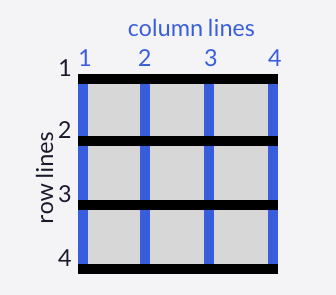

[Go to ToC](../README.md)

# CSS Grid

Grid helps to build complex web layouts. It turns HTML into a grid layout where you have rows and columns to place your items in.

## ToC
* [Display Grid](#display-grid)
* [Grid Template Columns](#grid-template-columns)
* [Grid Template Rows](#grid-template-rows)
* [Grid Units](#grid-units)
* [Grid Gap](#grid-gap)


* [Grid Column](#grid-column)
* [Grid Row](#grid-column)
* [Justify Self](#justify-self)
* [Align Self](#align-self)

* [Justify Items](#justify-items)
* [Align Items](#align-items)
* [Grid Template Area](#grid-template-area)
* [Grid Area](#grid-area)
* [Repeat](#repeat)
* [Minmax](#minmax)
* [Auto Fill](#auto-fill)
* [Autofit](#autofit)


### Display Grid  

To turn the container into a Grid layout, simply apply `display:grid;` css line to container element

```css
.container {
    font-size: 40px;
    width: 100%;
    background: LightGray;
   
    display:grid;
    
  }
```  
  
[🔝](#toc)  
  

### Grid Template Columns

Simply declaring `grid` doesn't change anything, but will give you the ability to create columns and rows.

To create columns, we use `grid-template-columns` on the container element as demonstrated:

```css
.container {
  display: grid;
  grid-template-columns: 50px 50px;
}
```
Total # values given determines # of **columns** and each value indicates how **wide** the column is. Example above, creates 2 columns with `width: 50px` each.  


[🔝](#toc)  
  
### Grid Template Rows

Previous example sets the rows automatically as needed. We can specify how many rows we need by using `grid-template-rows`. Declared same as `grid-template-column`:

```css
.container {
  display: grid;
  grid-template-columns: 100px 100px 100px;
  grid-template-rows: 50px 50px;
}
```

Total # values given determines # of **rows** and each value indicates how **tall** the row is. Example above, creates rows  with `height: 50px` each.  
  
[🔝](#toc)  

### Grid Units

Here's the list of units we can use when defining the size of rows and columns:

* `px` - absolute unit
* `em` - relative unit
* `fr` - sets the column or row to a **fraction** of the available space
* `auto` - sets the column or row to the width or height of the content
* `%` - adjusts the column or row to the percent width of its container.

```css
grid-template-columns: auto 50px 10% 2fr 1fr;
```
  
  
[🔝](#toc)  

### Grid Gap

If we want to give grid some gap, we would use either `grid-column-gap` or `grid-row-gap` property with values in `px`. There's a shorter version as well, which is just `grid-gap` where values will be for `row` first and `column` second.


```css
.container {
    grid-row-gap: 10px;
    grid-column-gap: 20px;
    grid-gap: 10px 20px;
}
```

  
[🔝](#toc)  

### Grid Column

So far we've seen properties that are used for `containers`. The rest of the propeties will be used on the items.

First one is the `grid-column` property. It is used to control grid spacing of the items.

Grid has `lines` which start with `1` in the left-upper corner. (See image below)

  

In a 3x3 grid, if we want to let the item consume space between 2nd and 4th line, we give the property as follows:

```css
.item {

    grid-column: 2 / 4;
}
```
   
  
[🔝](#toc)  

### Grid Row

`grid-row` is same as `grid-column` but instead determines how much grid space an item occupies *vertically*

```css
.item {
 grid-row: 2 / 4;
}
```

  
[🔝](#toc)  


### Justify Items

We can align the items in the grid **horizontally** with `justify-items` property. 
Values accepted are:

* `stretch` - [default]
* `start` - left side
* `center`
* `end` - right side

```css
.container {
    justify-items: center;
}
```
  
[🔝](#toc)  

### Align Items

We can align the items in the grid **vertically** with `align-items` property. 
Values accepted are:

* `stretch` - [default]
* `start` - left side
* `center`
* `end` - right side

```css
.container {
    align-items: end;
}
```

  
[🔝](#toc)  


### Justify Self

CSS Grid has *cell*, and you can align or justify items within this *cell*. One of the properties to align stuff within this cell *horizontally*, we use `justify-cell`
Values are as follows:
* `stretch` - [default]
* `start` - left side
* `center`
* `end` - right side

```css

.item {
    justify-self: center;
}
```

  
[🔝](#toc)  

### Align Self

Just like `justify-self`, `align-self` aligns items *vertically*. Same values apply:

```css
.item {
    justify-self: center;
    align-self: center;
}
```

  
[🔝](#toc)  

### Grid Template Area

We can group cells of our grid into *areas* and give it a custom *name*. This is done by using `grid-template-areas` property.
```css
.container {
    grid-template-areas:
        "header header header"
        "   .   content content"
        "footer footer footer"
}
```

The example above represents a 3x3 grid where first row is grouped into one and given a name "header"

:warning: You can specify empty space by putting `.`, last 2 blocks of the 2nd row is named "content"

Last row is grouped together and named "footer".

  
[🔝](#toc)  

### Grid Area

After we've declared a name for each area with `grid-template-areas`, we can choose an item and place it in one of those areas by using `grid-area` property

```css
.container {
    display: grid;
     grid-template-columns: 1fr 1fr 1fr;
    grid-template-rows: 1fr 1fr 1fr;
    grid-gap: 10px;
    grid-template-areas:
      "header header header"
      ". content content"
      "footer footer footer";
}
.item5 {
    grid-area: footer;
}
```

:warning: `grid-area` can be used without declaring `grid-template-areas` property in the container, by using *grid lines*

```css
.item5 {
   grid-area: 3/1/4/4;; /* h.start / v.start / h.end / v.end */
}
```
  
[🔝](#toc)  

### Repeat

When we used `grid-template-rows` and `grid-template-columns` we had to specify value for each column or row. What if we want 100 rows and 100 columns? It's not practical, that's why there's a `repeat()` function to specify the number of times you want your column or row to be repeated, followed by a comma and the value you want to repeat.

```css
.container {
    grid-template-rows: repeat(100, 50px);
}
```
:warning: You also can supply muliple values
```css
.container {
    grid-template-column: repeat(2, 1fr 50px) 20px /*[1fr 50px 1fr 50px 20px]
}
```
  
[🔝](#toc)  

### Minmax

There's another built-in function to define minimum and maximum width when we use `grid-template-rows` or `grid-template-columns`. It's called `minmax()`

```css
.containter {
    grid-template-columns: repeat(3, minmax(90px, 1fr));
}
```

  
[🔝](#toc)  

### Auto Fill

With `repeat`, as the first argument we can give `auto-fill` instead of specifying how many times it should repeat. This will insert as many rows or columns of desired size as possible depening on teh size of teh container.This will allow for a flexible layouts when combining `auto-fill` with `minmax`

```css

```


  
[🔝](#toc)  

### 


  
[🔝](#toc)  

### 


  
[🔝](#toc)  

### 


