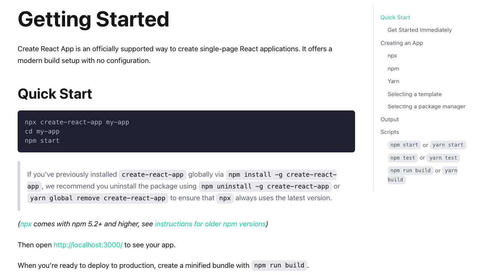
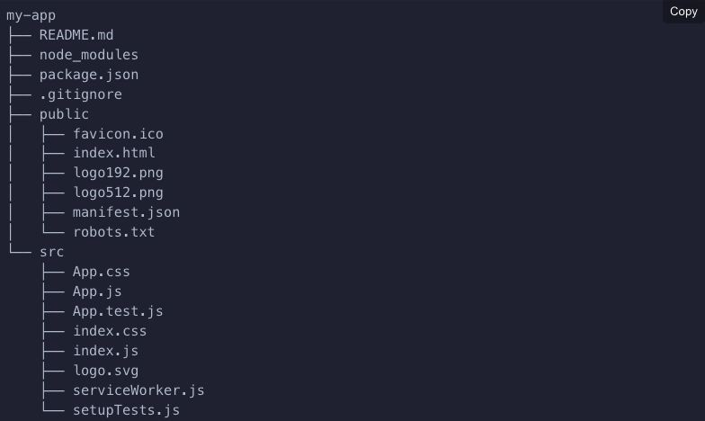
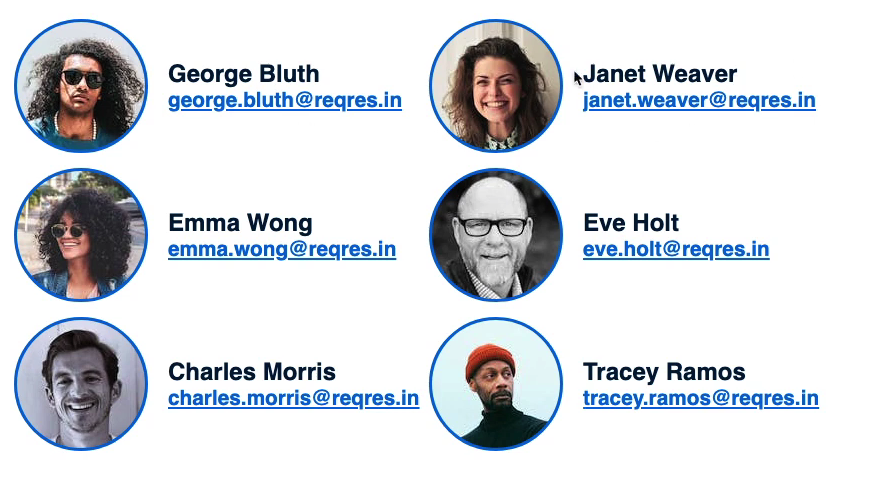

[Go to ToC](../README.md)

# Create React App

## ToC

- [Getting Started](#getting-started)
- [Profile Project](#profile-project)
- [ ](#)
- [ ](#)
- [ ](#)
- [](#)
- [](#)

### Getting Started

- Official Link: https://create-react-app.dev/docs/getting-started/
- "Create React App" is a tool to setup single-page React projects



- Running any of these commands will create a directory called my-app inside the current folder. Inside that directory, it will generate the initial project structure and install the transitive dependencies:



- Withe create-react-app we get default tools and dependencies chosen for us, for example, a bundler which is webpack.

[🔝](#toc)

### Profile Project

- We'll be building a project where there will be a list of profiles which comes from an api, and we will render it using react



- So the first thing is to get setup, run `create-react-app` and open it with VS Code

```terminal
npx create-react-app profiles
cd profiles
npm start
```

- Let's get rid of the boilerplate in `App.js`

[🔝](#toc)

###

[🔝](#toc)

###

[🔝](#toc)

###

[🔝](#toc)

###

[🔝](#toc)

###

[🔝](#toc)
