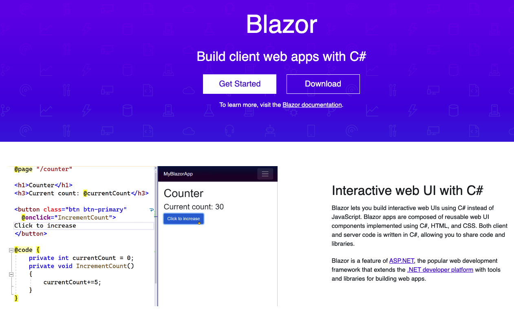

[Go to ToC](../README.md)

# Programming Using C#

## ToC

- [Introduction](#introduction)
- [Why C# ?](#why-c)
- [About C# and .NET](#about-c)
- [.NET Framework](#net-framework)
- [Demo](#demo)

### Introduction

- Welcome to C# —a powerful computer-programming language that’s used to build substantial computer applications.

[🔝](#toc)

### Why C#?

- C# in my opinion is more superior and easier than Java thanks to it's rich class library and latest features such as `async-await` and database connectivity with `LINQ`.

- C# is from a `C family` of high level languages like `C++` and `Java`, so the knowledge obtained by learning principles of one, can be applied to other OOP languages as well.

[🔝](#toc)

### About C#

- C# is pronounced as **`C Sharp`**
- The first version of C# was developed by **Microsoft** between 1999 and 2002 and was officially released to the public in **2002** as a part of the .NET platform
- C# is a **modern object-oriented, general-purpose programming language**, created and developed by Microsoft together with the .NET platform. There is highly diverse software developed with C# and on the .NET platform: office applications, web applications (Blazor), websites, desktop applications, mobile applications (MAUI), games (UNITY) and many others.
<div style="display:flex">
  
  
</div>

### .NET Framework

- **.NET Framework** generally consists of an environment for the development and execution of programs, written in C# or some other language, compatible with .NET (like VB.NET, Managed C++, J# or F#). It consists of:
  - the .NET **programming languages** (C#, Visual Basic and others);
  - an environment for the execution of managed code (**CLR**), which executes C# programs in a controlled manner;
  - a set of development tools, such as the **`csc` compiler**, which turns C# programs into intermediate code (called MSIL) that the CLR can understand;
  - a set of standard libraries, like **ADO NET**, which allow access to databases (such as MS SQL Server or MySQL) and **WCF** which connects applications through standard communication frameworks and protocols like HTTP, REST, JSON, SOAP and TCP sockets.

[🔝](#toc)

### Demo

Before looking at the examples of writing this let's look at the contents of this code first

```Csharp
class Program
{
    static void Main(string[] args)
    {
        System.Console.WriteLine("Hello C#!");
    }
}
```

- On the first line of our program we define a `class` called `Program`. The simplest definition of a class consists of the keyword `class`, followed by its name. In our case the name of the class is `Program`. The content of the class is located in a block of program lines, surrounded by curly brackets: `{}`.
- On the third line we define a method with the name `Main()`, which is the starting point for our program. Every program written in C# starts from a `Main()` method with the following title (signature)
- The content of every method is found after its signature, surrounded by opening and closing curly brackets. On the next line of our sample program we use the system object `System.Console` and its method `WriteLine()` to print a message on the default output (the console), in this case `"Hello, C#!"`.

[🔝](#toc)

`Task:` Write `Hello World` C# program using text editor and `csc` compiler

`Task:` Write `Hello World` C# program using Visual Studio.

###

[🔝](#toc)

:warning: Difference between .NET and .NET Framework
https://docs.microsoft.com/en-us/dotnet/standard/choosing-core-framework-server
