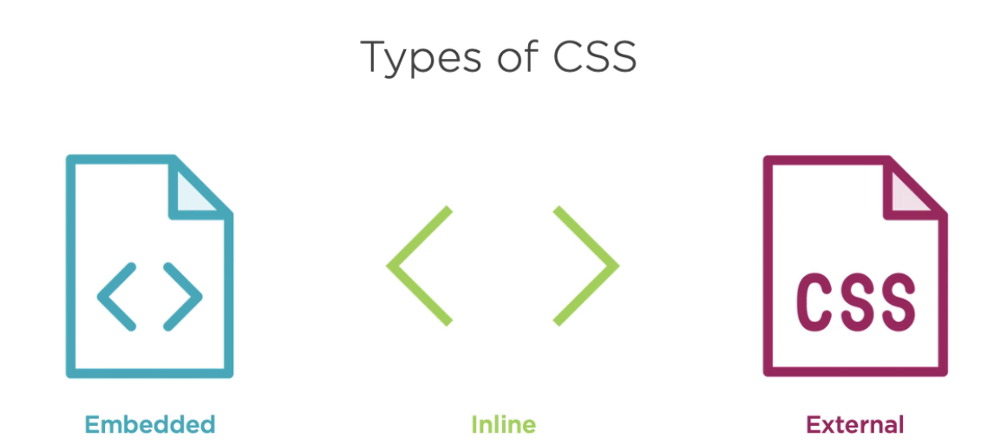
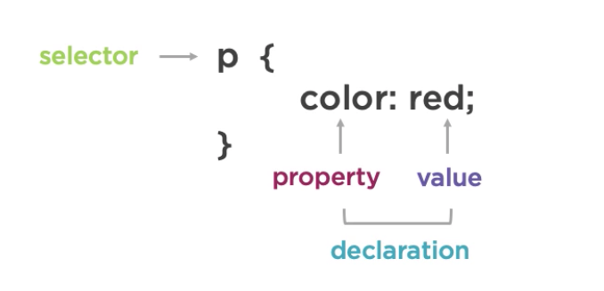
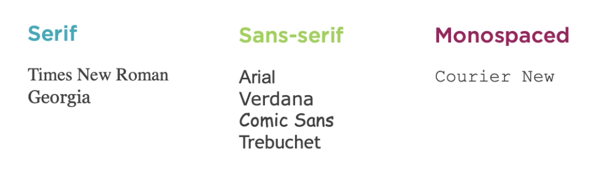

[Go to ToC](../README.md)

# Day 3 - CSS3

Topics:

* [CSS Intro](#css-intro)
* [Change Color Of Text](#change-color-of-text)
* [CSS Element Selectors](#css-element-selectors)
* [CSS Class Selector](#css-class-selectors)
* [Style Multiple Elements With CSS Class](#style-multiple-elements-with-css-class)
* [Font-Size](#font-size)
* [Font-Family](#font-family)
* [Import Google Font](#import-google-font)
* [Change Image Size](#change-image-size)
* [Add Borders](#add-borders)
* [Background Colour](#background-colour)
* [Set an ID for an element](#set-an-id-for-an-element)
* [Style using id attribute](#style-using-id-attribute)
* [padding](#padding)
* [margin](#margin)
* [Clockwise notation](#clockwise-notation)
* [Attribute Selectors To Style](#attribute-selectors-to-style)
* [Absolute vs Relative](#absolute-vs-relative)
* [Inheritance, Overriding and Priority](#)
* [Inheritance, Overriding and Priority](#inheritance-overriding-and-priority)
* [HEX and RGB colours](#hex-and-rgb-colours)
* [CSS Variables](#css-variables)


### CSS Intro

* CSS - Cascading Style Sheets  

* ⚠️ Case Sensitive  

CSS allows to control major styling of your page:
* color
* fonts
* spacing
* sizing
* decorations
* transitions
* layout
* and more

There are 3 ways to include CSS code:



1. *Inline* using `style` attribute in html file
```html
<h1 style="color: red">Hello World!</h1>
```
2. *Embedded* using `<style>` element in html file 
```html
<!DOCTYPE html>
<html>
    <head>
        <title>HTML darsi</title>
        <style>
            h1 {
                color: red;
            } 
        </style>
    </head>
    <body>
    <!-- ......... -->
```
3. *External* using separate css file and link in html file

```html
<!DOCTYPE html>
<html>
  <head>
    <link rel="stylesheet" type="text/css" href="global.css">
  </head>
  <body>
  <!-- ......... -->
```
```css
h1 {
  color: red
}
```  
[🔝](#day-3---css3)  

### Change Color Of Text

This can be done by changing `style` of the element and using property  `color` as shown below:

```html
<h1 style="color: red;">Hello World</h1>  
```

⚠️ Should end with `;`  

[🔝](#day-3---css3) 

### CSS Element Selectors

The above example was an inline and not a best way to write CSS.  

We can use embedded style with `<style>` element within html  

Inside this `<style>` block we should use `selector` to *select* which element we would like to style.  

Since we want to style `<h1>` element, we would specify an element in this format

```html
<style>
    h1 {
        color: red;
    }
</style>
```



⚠️  After choosing a selector to style, we should use `{` , `}` and include all the properties we would like to enter by ending each one with `;`  

[🔝](#day-3---css3)  

### CSS Class Selector

Besides elements, you can pick and choose a class to style. Whichever element that has that class will be changed once you change CSS properties.  

```html
<style>
   .red-text {
        color: red;
    }
</style>
<body>
    <h1 class="red-text">Hello World</h1>
    <!-- ...... -->
```
⚠️ Notice how we specified a class selector with a `.` in front of it? That's how classes are *selected* in CSS  

[🔝](#day-3---css3)  

### Style Multiple Elements With CSS Class

Classes allows you to use the same style to all elements that are part of that class

```html
```html
<style>
   .red-text {
        color: red;
    }
</style>
<body>
    <h1 class="red-text">Hello World</h1>
    <p class="red-text">Lorem Ipsum...</p>
    <!-- ...... -->
```  

`h1` and `p` on the above example will have `red` text becuase they are part of the same class  

[🔝](#day-3---css3)  

### Font-Size

Font size is controlled by `font-size` property and values can be given in `px` (pixels)

```html
<style>
    h1 {
        font-size: 30px;
    }
</style>
```  
[🔝](#day-3---css3)  

### Font-Family

  

To choose which font a text should use, we should specify `font-family` property.

```html
<style>
    h1 {
        font-family: Arial, Helvetica, sans-serif;
    }
</style>
```  
⚠️ It is possible to give multiple fonts in case the first one is not present on user's machine. So always include "web safe" fonts as the last option since it will most likely be present on user's machien.  

[🔝](#day-3---css3)  

### Import Google Font

Google Fonts has a free library of fonts we can use in our web page. Here's the code how to do this:
* Include a reference to the web api on google's server
```html
<!-- We want to get a font named "Roboto" -->
<link href="https://fonts.googleapis.com/css?family=Roboto" rel="stylesheet" type="text/css">
```

* Place the above link within `<head>` tags. Now `Roboto` font is available for us to use in our CSS.

```css
font-family: FAMILY_NAME, GENERIC_NAME
```
* FAMILY_NAME will render our `Roboto` font. GENERIC_NAME is a fall back font in case `Roboto` doesn't render  


### Change Image Size

CSS has a `width` property which controls element's width. We can specify it in `px` (pixels)

```html
<style>
  .large-image {
    width: 500px;
  }
</style>
<!-- ......... -->


<!-- .......... -->
```

[🔝](#day-3---css3)   


### Add Borders

CSS borders have properties like
* `border-style` -> values can be `dotted`, `solid`, `double`, `dashed`
* `border-width` -> values can be specified in `px`
* `border-color` -> values can be any colour, RGB or hex
* `border-radius`-> values can be specified in `px` or `%`

```html
<style>
  .thin-red-border {
    border-color: red;
    border-width: 5px;
    border-style: solid;
    border-radius: 50%; // makes it round
  }
</style>

<!-- ......... -->


<!-- .......... -->
```  

[🔝](#day-3---css3)  

### Background Colour

You can set element's background colour by using `background-color` property.

```html

<style>
    .colorful-background {
        background-color: red;
    }
</style>

<!-- ......... -->

<div class="colorful-background">

<!-- .......... -->
```

### Set an ID for an element

In addition to classes, each HTML element can also have an id attribute.  

There are several benefits to using id attributes: You can use an id to style a single element and later you'll learn that you can use them to select and modify specific elements with JavaScript.  

id attributes should be **unique**. Browsers won't enforce this, but it is a widely agreed upon best practice. So please don't give more than one element the same id attribute.  

```html
<h2 id="hello">Hello World!</h2>
```
  
[🔝](#day-3---css3)   

### Style using `id` attribute

You can also style it using id in CSS 

```html
<style>
   #hello {
      background-color: green   
   }
   
</style>

<!-- ......... -->

<h2 id="hello" class="header2">Hello World!</h2>

<!-- ......... -->   
```
  
⚠️ Note that inside your style element, you always reference classes by putting a . in front of their names. You always reference ids by putting a # in front of their names.

[🔝](#day-3---css3)  


 ### `padding`
 
 
 
 CSS allows you to control the padding of all four individual sides of an element:
 * padding-top
 * padding-right
 * padding-bottom
 * padding-left
 
 It's value is denoted by `px`  
 
```html
<style>
  .injected-text {
    margin-bottom: -25px;
    text-align: center;
  }

  .box {
    border-style: solid;
    border-color: black;
    border-width: 5px;
    text-align: center;
  }

  .yellow-box {
    background-color: yellow;
    padding: 10px;
  }

  .red-box {
    background-color: crimson;
    color: #fff;
    padding-top: 40px;
    padding-right: 20px;
    padding-bottom: 20px;
    padding-left: 40px;
  }

  .blue-box {
    background-color: blue;
    color: #fff;
  }
</style>
<h5 class="injected-text">margin</h5>

<div class="box yellow-box">
  <h5 class="box red-box">padding</h5>
  <h5 class="box blue-box">padding</h5>
</div>
```  
 [🔝](#day-3---css3)    
 
 
 ### `margin`
 
 An element's margin controls the amount of space between an element's border and surrounding elements.    
 
 When you increase the blue box's margin, it will increase the distance between its border and surrounding elements.  
 
```html
<style>
  .injected-text {
    margin-bottom: -25px;
    text-align: center;
  }

  .box {
    border-style: solid;
    border-color: black;
    border-width: 5px;
    text-align: center;
  }

  .yellow-box {
    background-color: yellow;
    padding: 10px;
  }

  .red-box {
    background-color: crimson;
    color: #fff;
    padding: 20px;
    margin: 20px;
  }

  .blue-box {
    background-color: blue;
    color: #fff;
    padding: 20px;
    margin: 10px;
  }
</style>
<h5 class="injected-text">margin</h5>

<div class="box yellow-box">
  <h5 class="box red-box">padding</h5>
  <h5 class="box blue-box">padding</h5>
</div>

```

### Clockwise notation

Instead of giving values to properties like `padding-left` or `margin-top`, `padding` and `margin` supports clockwise notation for values. For example:

```html

`padding: 0px 10px 0px 10px`

```

The above code is same as saying: 

```html
padding-top: 0px;
padding-right: 10px;
padding-bottom: 0px;
padding-left: 10px;
```
Same can be applied to `margin`  

[🔝](#day-3---css3)    

### Attribute Selectors To Style

So far, we've seen how to style elements using it's `id` and `class` attributes. You also can use other element attributes to style their elements:
For example, if we have an `input` element with `type="radio"`, we can use `type="radio"` attribute to style it

```html

[type='ratio'] {
    margin: 20px 20px 20px 20px
}

```  
[🔝](#day-3---css3)   

### Absolute vs Relative

So far we've seen giving values in `px` which is a pixel length. There are other measurement units such as `mm` for millimeter or `in` for inch.  

There are 2 types of length units:

    * Absolute - approximate the actual measurement on a screen, but there are some differences depending on a screen's resolution.
        * `px`
        * `mm`
        * `in`
    * Relative - relative to another length value
        * `em` - For example, em is based on the size of an element's font. If you use it to set the `font-size` property itself, it's relative to the parent's font-size
        * `rem`
        
### Inheritance, Overriding and Priority

* Every  `html` page will have a `body` element. Which means you can still style the whole page by using `body` as the selector

```html
<style>
  body {
    background-color: black;
    font-family: monospace;
    color: green;
  }
</style>
<h1>Hello World!</h1>
```
Example above, all text in the html will be green. But we can still override this by setting all `h1` to colour `pink`

```html
<style>
  body {
    background-color: black;
    font-family: monospace;
    color: green;
  }
  .pink-text{
    color: pink;
  }
</style>
<h1 class="pink-text">Hello World!</h1>
```

This will _override_ `body` element's colour  

* OK, but what happens if the element has 2 classes ? Example below

```html
<style>
  body {
    background-color: black;
    font-family: monospace;
    color: green;
  }
  .pink-text {
    color: pink;
  }
  .blue-text {
    color: blue;
  }  
</style>
<h1 class="pink-text blue-text">Hello World!</h1>
```
The text will be blue because .blue-text came after .pink-text and it takes precedence. So in CSS it's executed from top to bottom.  


* OK, but what happens when we give `<h1>` an ID and style the color as `orange`. What colour `<h1` will be? Example below

```html
<style>
  body {
    background-color: black;
    font-family: monospace;
    color: green;
  }
  #orange-text {
    color: orange;
  }
  .pink-text {
    color: pink;
  }
  .blue-text {
    color: blue;
  }  
  
  
</style>
<h1 id="orange-text" class="pink-text blue-text">Hello World!</h1>
```

The colour will be `orange`, because, `id` takes higher precedence than `class`, no matter where you put the selector. 

* OK, how about if we give an `inline` style to an element? What colour our `h1` will be? Example below

```html
<style>
  body {
    background-color: black;
    font-family: monospace;
    color: green;
  }
  #orange-text {
    color: orange;
  }
  .pink-text {
    color: pink;
  }
  .blue-text {
    color: blue;
  }  
</style>

<h1 style="color: green" id="orange-text" class="pink-text blue-text">Hello World!</h1>
```

The colour will be `green` because `inline style` has more priority than `id` or `class`

We just proved that inline styles will override all the CSS declarations in your style element.  But wait. There's one last way to override CSS. This is the most powerful method of all

```html
!important
```

So when you absolutely need to be sure that an element has specific CSS, you can use `!important`

```html
<style>
  body {
    background-color: black;
    font-family: monospace;
    color: green;
  }
  #orange-text {
    color: orange;
  }
  .pink-text {
    color: pink !important;
  }
  .blue-text {
    color: blue;
  }  
</style>

<h1 style="color: green" id="orange-text" class="pink-text blue-text">Hello World!</h1>
```

Now `h1` will be orange because `!important` will override all.  

[🔝](#day-3---css3)   

 
### HEX and RGB colours

So far we've seen to set the colours using `color: black` or `color: white` and so on. We can also use a specific colors using `hex` and `rgb` notations

* HEX:
    * We usually use decimals, or base 10 numbers, which use the symbols 0 to 9 for each digit. Hexadecimals (or hex) are base 16 numbers. This means it uses sixteen distinct symbols. Like decimals, the symbols 0-9 represent the values zero to nine. Then A,B,C,D,E,F represent the values ten to fifteen. Altogether, 0 to F can represent a digit in hexadecimal, giving us 16 total possible values
    * In CSS, we can use 6 hexadecimal digits to represent colors, two each for the red (R), green (G), and blue (B) components. For example, #000000 is black and is also the lowest possible value. 
    ``` css
        color: #000000
    ```
    * First 2 digits is for range of the `red`, second 2 digits is for `green`, last 2 digits is for `blue`: range is 0 to F
* RGB:
    * Just like hex, we can use `rgb` notation where we can give values from 0 to 255 for each red, green or blue
    ```html
    body {
      background-color: rgb(255, 165, 0);
    }
    ```

### CSS Variables

Sometimes when you have a certain colour you use a lot and suddenly you decide to change it, you'd have to go through every element where you used that specific colour to edit it. You can use CSS variables to make your life easier by just changing the variables value.
This is how you declare and use a variable.

```html
<style>
    body {
        --my-favourite-color: purple;
    }
    h1 {
        color: var(--my-favourite-color);
    }
    .some-class {
        background-color: var(--my-favourite-color);
    }
<style>
```

When declared, use `--` in front of the property and give it a `value` after `:`. 
When it's time to use it, select a property and use `var(--variable-name-here, fallback)` notation.

⚠️ You can also provide `fallback value` after `,` in case variable doesn't exist or something goes wrong in the browser.  

[🔝](#day-3---css3)   


