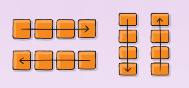
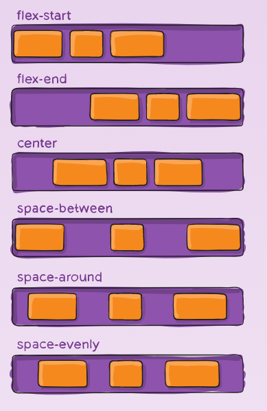
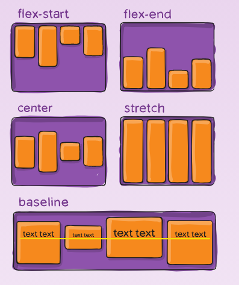

[Go to ToC](../README.md)

# CSS Flexbox

## ToC
* [Using Flexbox](#using-flexbox)
* [Flex Direction ](#flex-direction)
* [Justify Content](#justify-content)
* [Align Items](#align-items)
* [Flex Wrap](#flex-wrap)
* [Flex Shrink](#flex-shrink)
* [Flex Grow](#flex-grow)
* [Flex Basis](#flex-basis)
* [Flex Shortcut](#flex-shortcut)
* [Order Property](#order-property)
* [Align Self](#align-self)

### Using Flexbox

* Came out on October 2017, provides an efficient way to layout, align and distribute space among items in a container. 
* To start using `flex` we declare `display: flex` inside a container

```css
.box-container {
  display: flex;
}
```
:warning: `flex` is more appropriate for smaller size components, whereas `grid` is intended for larger scale layouts.

[🔝](#toc)  
  

### Flex Direction

* Once we declare the container as `flex`, we can align any children into *rows* and *columns* by using `flex-direction` property in **container CSS**.

Values are:
* `row` - [DEFAULT]
* `row-reverse` 
* `column`
* `column-reverse`

```css
#box-container {
    display: flex;
    height: 500px;
    flex-direction: row-reverse;
}
```



[🔝](#toc)  
  
### Justify Content

`justify-content:` defines the alignment along the **main** axis, through the items. 
* For `flex-direction: row` the **axis** is **hozirontal** 
* For `flex-direction: column` the **axis** is **vertical**

```css
#box-container {
    background: gray;
    display: flex;
    height: 500px;
    justify-content: center;
  }
```  

* `flex-start` - pushes items to the left [DEFAULT]
* `flex-end` - pushes items to the right
* `center` - align center
* `space-between` - aligns items to the center with extra space in between. First and Last items are pushed to the edge of left and right respectively
* `space-around` - similar to `space-between`, but first and last items are NOT pushed to the edge, but have some space.
* `space-evenly` - distributes equal space between items.




  
[🔝](#toc)  

### Align Items
  
`align-items: ` defines alignment along the **cross** axis.  
For a row, it tells CSS how to push the items in the entire row up and down  
For a column, how to push all the items left or right within a container.
  
  
  


  
[🔝](#toc)  

### Flex Wrap

We also can split items in a row. This means extra items move into a new row or column. 
The break point of where the wrapping happens depends on teh size of the items and teh size of the container.

```css
#box-container {
    background: gray;
    display: flex;
    height: 100%;
    flex-wrap: wrap;  
}
```


  
[🔝](#toc)  

### Flex Shrink

So far, all the properties we discussed goes to the container/parent of the items. We have few other properties that goes to the items themselves.. 

First, let's see what `flex-shrink` does: Items shrink when the width of the parent container is smaller than the combined widths of all the flex items within it.

It takes numbers as values (default = 1). Where `x` is how many times the item is going to shrink compared to the other item.

```css
#box-2 {
    background-color: orangered;
    width: 100%;
    height: 200px;
    flex-shrink: 2;
}
```
:warning: Negative numbers are invalid

[🔝](#toc)    
  
  
### Flex Grow

`flex-grow` is the opposite of `flex-shrink`. 

When the conainter expands, the items grow depending on the number we've given in `flex-grow`;

It takes numbers as values (default = 0). Where `x` is how many times the item is going to expand compared to the other item.

```css
  #box-1 {
    background-color: dodgerblue;
    height: 200px;
    flex-grow: 1;
  }

  #box-2 {
    background-color: orangered;
    height: 200px;
    flex-grow: 2;
  }
```
:warning: Negative numbers are invalid
  
[🔝](#toc)  

  
  
### Flex Basis

The `flex-basis` property specifies the initial size of the item before CSS makes adjustments with `flex-shrink` or `flex-grow`

Default value is = `auto`

Units used are `px`, `em`, `%`, etc.

```css 
  #box-1 {
    background-color: dodgerblue;
    height: 200px;
    flex-basis: 10em;
  }

  #box-2 {
    background-color: orangered;
    height: 200px;
    flex-basis: 20em;
  }
```
  
[🔝](#toc)  

  
  
### Flex Shortcut

Box 1 will grow twice as fast once it's width is more than 150px
Box 1 will shrink twice as fast once it's width is less than 150px
Box 2 will grow once it's width is more than 150.

```css
   #box-1 {
    background-color: dodgerblue;
    flex: 2 2 150px;
    height: 200px;
  }

  #box-2 {
    background-color: orangered;
    flex: 1 1 150px;
    height: 200px;
  }
```
  
[🔝](#toc)  

    
### Order Property

We can give order to individual items with `order` property.

It accepts numbers as values as well as negative numbers.

```css
 #box-1 {
    background-color: dodgerblue;
    order: 2;
    height: 200px;
    width: 200px;
  }

  #box-2 {
    background-color: orangered;
    order: 1;
    height: 200px;
    width: 200px;
  }
```

  
[🔝](#toc)  

 
    
### Align Self

`align-self` property allows to align items individually, instead setting them all at once using `align-items`
Accepts same values as `align-items`:
* `flext-start`
* `flex-end`
* `center`
* `stretch`
* `baseline

```css
#box-1 {
    background-color: dodgerblue;
    align-self: center;
    height: 200px;
    width: 200px;
  }

  #box-2 {
    background-color: orangered;
    align-self: flex-end;
    height: 200px;
    width: 200px;
  }
```


  
[🔝](#toc)  

  

  
  
